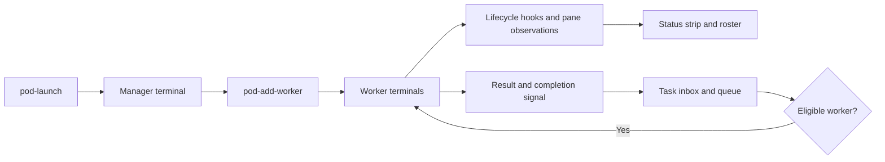

# A human guide to agent-pods

This project puts several command-line agents into one tmux session so a person can see their terminals, give them work, and follow their progress. It provides the workspace and dispatch machinery; the agents supply the reasoning.

[`bin/pod-launch`](bin/pod-launch) resolves configuration, chooses an installed agent adapter, and creates or attaches to a session. [`bin/pod-add-worker`](bin/pod-add-worker) adds an agent terminal. [`adapters/`](adapters/) describes how different agent programs launch; [`config/`](config/) supplies portable defaults.

The terminal's existence, whether its agent is busy, and whether it has an assigned task are different facts. Hooks under [`hooks/`](hooks/) report lifecycle events. Status helpers under [`bin/`](bin/) make those facts visible. Uncertain runtime state should not be read as an idle worker.

The optional queue module under [`modules/queue/`](modules/queue/) stages task prompts, queues work, dispatches to eligible workers, and consumes completion signals. A task is text in an inbox plus a result location. Dispatch is a handoff, not a guarantee that the requested work succeeded.

Read `bin/pod-launch`, `bin/pod-add-worker`, and the queue module in that order. The appearance of the strip is separate from the rules that make dispatch safe. [`test/`](test/) exercises the shell-level contracts. Installing hooks or launching a pod changes the local agent/terminal environment; reading this guide does not require launching anything.
